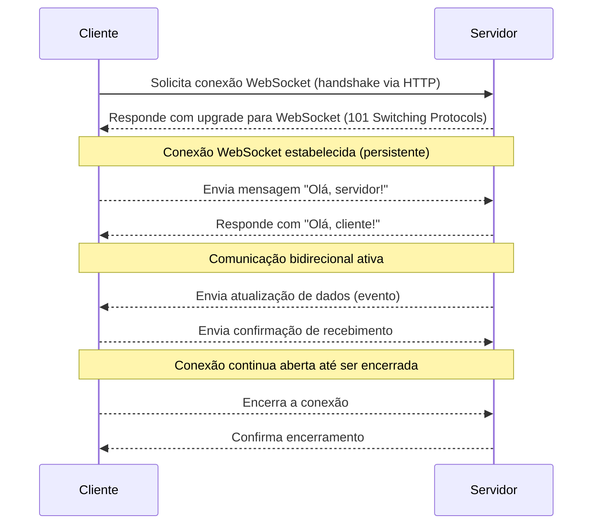

# Jogo da Velha

## Visão geral

Projeto desenvolvido a pedido do professor **Helton Fábio** segue o link do repositório da descrição da [atividade proposta](https://github.com/prof-hfabio/AV1).

Eu escolhi a proposta nº dois, que diz:

```
Descrição: O aluno deverá criar uma página web que contenha elementos básicos do HTML e tenha uma finalidade. Seja uma calculadora, um calendário, um jogo ou mesmo um clone de alguma página web existente. A página deve conter:

* Estrutura semântica utilizando HTML5 (cabeçalho, rodapé, seções, formulários, tabelas, imagens etc).
* Estilização básica com CSS3 (cores, fontes, layouts simples).
* A página deve ser responsiva e funcionar corretamente em 2 tamanhos de tela (1920x1080 e 430x932)
* Um relatório em Markdown explicando as escolhas semânticas e as técnicas de estilização aplicadas, além de uma breve reflexão sobre a importância de separar estrutura e estilização.

Critério de avaliação
A escrita semântica do HTML e do CSS serão os principais pontos de avaliação nesta atividade, a escrita do relatório em markdown será utilizado como bônus para esta avaliação. A estética não é um critério pontual de avaliação, entretanto as técnicas empregadas serão, então atenção ao escrever o CSS
```

Com isso resolvi desenvolver o jogo da velha 1v1 para poder jogar com os amigos(não com robô), ao achar `simples`, resolvi implementar a capacidade de jogar 'online' isto é em dois dispositivos(ou duas abas).

## Rodar a aplicação

```sh
npm run dev # para ambiente de teste (Somente no Ubuntu e derivados(com gnome-terminal))

# Abre o terminal que entra no client-side e roda o client side no vite
# Roda o servidor


npm run build # Compila o client-side, e copia os arquivos para /public

npm run start # Roda A aplicação em produção
```

## Tecnologias usadas

| Nome             | Objetivo                                                         | Stack     |
| ---------------- | ---------------------------------------------------------------- | --------- |
| JavaScript       | Linguagem usada                                                  | Ambos     |
| NodeJs           | Runtime JavaScript para roda-lo fora do navegador                | Back-End  |
| Express          | Manipular e gerenciar o servidor                                 | Back-End  |
| Socket.io        | Comunicação WebSocket(tempo real)                                | Back-End  |
| Socket.io-Client | Comunica com o socket.io                                         | Front-End |
| Vite             | Biblioteca que auxilia na inicialização de aplicações JavaScript | Front-End |
| React.js         | Biblioteca para criação de componentes e páginas web             | Front-End |
| SASS             | Biblioteca de Estilo, auxiliar do CSS                            | Front-End |

## WebSocket

WebSocket é um protocolo de comunicação full-duplex, ela é persistente, enquanto o HTTP o cliente busca no servidor, e o servidor responde, o WS ele é persistente, mesmo após uma resposta ele ainda fica ativo aguardando um novo evento.



### Vantagens do WebSocket

- O Websocket tem uma **comunicação persistente** , pois após estabelecido não precisa enviar outra requisição para troca de dados;
- Contém uma **baixa latência**, sendo perfeito para comunicação em tempo real, jogos online, etc.
- É bi-direcional(_full-duplex_), a comunicação pode ocorrer de cliente para servidor, servidor para cliente, cliente para cliente, ou servidor para servidor.
- Ideal para **push e eventos**: O servidor pode enviar dados assim que algo acontecer, sem precisar que o cliente consulte constantemente.
- **Menor sobrecarga de dados**: Comparado com HTTP tradicional (com headers pesados a cada requisição), WebSocket tem menos overhead após o handshake inicial.

### Desvantagens do WebSocket

- **Não é suportado por todos os proxies/firewalls**: Alguns ambientes corporativos podem bloquear ou filtrar conexões WebSocket.

- **Gerenciamento de escalabilidade**: Manter milhares de conexões simultâneas abertas exige mais recursos do servidor.

- **Mais complexo de implementar**: Comparado ao HTTP, exige controle de estado, reconexão e tratamento de falhas.

- **Sem cache nativo**: Diferente do HTTP, WebSocket não se beneficia de mecanismos de cache entre cliente e servidor.

- **Segurança**: Requer cuidado extra com autenticação e criptografia (deve usar `wss://` para garantir segurança).
